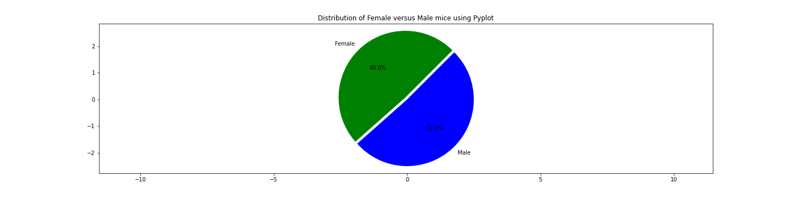

# Matplotlib

## Introduction

The data analysis using plots is for a pharmaceutical company based out of San Diego. Pymaceuticals specializes in anti-cancer pharmaceuticals. In its most recent efforts, it began screening for potential treatments for squamous cell carcinoma (SCC), a commonly occurring form of skin cancer.

The access is given to the complete data from their most recent animal study. In this study, 249 mice identified with SCC tumor growth were treated through a variety of drug regimens. Over the course of 45 days, tumor development was observed and measured. The purpose of this study was to compare the performance of Pymaceuticals' drug of interest, Capomulin, versus the other treatment regimens. The task is to generate all the tables and figures needed for the technical report of the study and also for a top-level summary of the study results.

## Analysis

Below are the analysis made on the mouse data and the various types of plots that were used to show the analysis:

* Before beginning the analysis, the data is checked for mouse ID with duplicate time points and the same is removed to arrive at the clean dataset. The total mouse count is 249 and for one mice, there were duplicate data. The was filtered to arrive at a clean dataframe with 248 mice. Then a summary statistics table consisting of the mean, median, variance, standard deviation, and SEM of the tumor volume for each drug regimen is calculated. 

* The bar plots were created showing the total number of measurements taken for each treatment regimen throughout the course of the study, using pandas and pyplot.

* The data was group using the gender of the mice and pie plots were generated using both Pandas's `DataFrame.plot()` and Matplotlib's `pyplot` that shows the distribution of female or male mice in the study.

* The final tumor volume of each mouse across four of the most promising treatment regimens, were calculated: Capomulin, Ramicane, Infubinol, and Ceftamin. Then the potential outliers across all four treatment regimens are calculated.

* Using Matplotlib, a box and whisker plot of the final tumor volume for all four treatment regimens are determined and any potential outliers are highlighted.

* A mouse ID was selected, that was treated with Capomulin and a line plot of tumor volume vs. time point for that mouse was generated.

* A scatter plot was generated of mouse weight versus average tumor volume for the Capomulin treatment regimen.

* The correlation coefficient and linear regression model value is calculated between mouse weight and average tumor volume for the Capomulin treatment. The linear regression model is plotted on top of the previous scatter plot.

